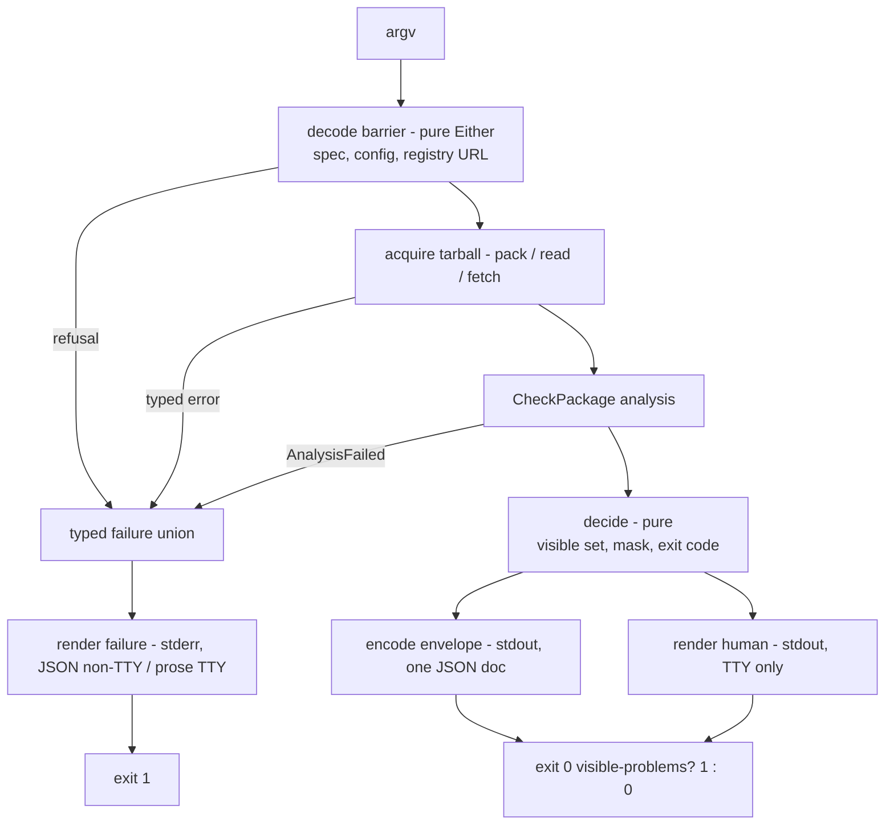

# Agent-first attw CLI - Plan

## Goal Capsule

- **Objective:** Any non-TTY caller of `attw` — an agent, a script, CI — gets a predictable machine contract: exactly one schema-described JSON document on stdout, typed failures with recovery sentences on stderr, and an exit code that never reports a failed analysis as clean. A human on a TTY sees today's tables unchanged. Verifiable from outside the binary: pipe `attw` into `jq` and it either parses as the described envelope, or stdout is empty and stderr carries a typed error document.
- **Means:** Retrofit the existing single-command Effect CLI per the user's agent-first ruling, on its build order (KTD1).
- **Authority hierarchy:** the user's agent-first ruling attachment governs product behavior; the repo constitution governs structure; this plan's KTDs govern mechanism within those.
- **Stop conditions:** every R-ID verified through the Verification Contract; `pnpm check:ci` and `pnpm test:e2e` green; no fabricated green path remains (the `types: false` swallow is deleted).
- **Execution profile:** `code`; units are independently landable commits.

---

## Product Contract

### Summary

Convert the published `attw` CLI (`apps/arethetypeswrong-cli`) from human-TTY-first to agent-first: non-TTY stdout defaults to one compact JSON envelope; progress, hints, and typed failures move to stderr; input decode is fail-closed and adversarially hardened; a `schema` subcommand self-describes the input surface and output envelope from the same Effect Schemas that decode them; output is default-tight with opt-in expansion; SKILL.md/CONTEXT.md ship with the package; a fixture eval corpus observes agent-shaped usage. The TTY rendering path is unchanged.

### Problem Frame

The CLI today is a human instrument that lies to programs. `runAttw` hardcodes `isTTY: true` and `terminalWidth: 120` (`apps/arethetypeswrong-cli/src/AttwExecutor.ts`), so a piped invocation receives ANSI tables, not data. JSON is opt-in (`-f json`), always pretty-printed, and dumps the whole analysis including traces and an untyped `programInfo` hole. Every acquisition failure is `Effect.orDie`'d into a defect; an analysis failure is swallowed into a synthetic `{ types: false, packageVersion: 'error' }` result that renders "has no types" and exits 0 — a crash reported as a clean, untyped, passing package. The `.attw.json` config decodes as `Schema.Unknown` with errors silently skipped; the npm package spec is parsed by `split('@')` with no rejection of control characters, welded query strings, or overlength input; the version segment is concatenated raw into the registry URL. Nothing describes the tool's own contract to a machine: no schema dump, no field masks, no skills. An agent must parse English tables it was never meant to see.

### Key Decisions

- KD1. Non-TTY stdout is machine JSON by default; `--json` opt-in retrofit is rejected (session-settled: user-directed — chosen over keeping human-format default with opt-in `--json`: models forget the flag and then English gets parsed; core bet of the ruling). Governs R1, R2, R3.
- KD2. stdout carries the value; stderr carries chatter, hints, and typed failures; exit non-zero means typed failure (session-settled: user-directed — chosen over mixed-stream output: stream separation is how an agent tells a result from a log line). Governs R1, R5.
- KD3. The binary self-describes: a machine-readable schema surface generated from the same Schemas that decode input and describe output (session-settled: user-directed — chosen over prose-only `--help`: prompt-borne docs rot and cost tokens every turn). Governs R7.
- KD4. Decode is fail-closed and treats argv as adversarial input (session-settled: user-directed — chosen over "please don't" prose: refusal must be the re-firing command, not a paragraph). Governs R6.
- KD5. Skills artifacts (`SKILL.md`, `CONTEXT.md`) carry the invariants `--help` cannot (session-settled: user-directed — chosen over stuffing the system prompt: progressive disclosure beats context stuffing). Governs R9.

### Actors

- A1. **Human** — runs `attw` on a TTY; receives tables/ASCII/emoji; unchanged.
- A2. **Agent** — any non-TTY caller (LLM agent, script, CI) that reads stdout as data and branches on exit codes and stderr documents.

### Requirements

**Output contract**

- R1. Non-TTY stdout carries exactly one JSON document and nothing else; all chatter, progress, hints, and failures go to stderr. TTY stdout is today's rendering byte-for-byte. Explicit `-f table|table-flipped|ascii` wins over the non-TTY default; `-f json` means the envelope on any stream; `auto` resolves by persona (TTY table path, non-TTY envelope).
- R2. The machine envelope is described by a CLI-owned Schema with an explicit `status` discriminant (`ok` | `untyped`); the untyped variant omits `problems`/`entrypoints` rather than encoding state by field presence.
- R3. The default envelope is field-tight: `status`, `packageName`, `packageVersion`, `types`, `problems` (the visible set), and a `problemCounts` record replace the prose `summary` string. Per-problem trace arrays, `programInfo`, the full `entrypoints` graph, and `buildTools` are omitted unless explicitly included. Expansion is one opt-in flag.
- R4. Exit code and machine envelope agree by construction: one pure decision produces both the envelope's visible problem set and the exit code, ending the current split where `--profile node16` silences node10 problems in the exit code but still renders them. TTY rendering keeps today's filtering unchanged (R1's byte-for-byte promise governs the human path).

**Failure contract**

- R5. Every failure is a tagged variant in a typed union carrying a recovery sentence, rendered to stderr as a JSON error document on non-TTY and prose on TTY. The synthetic `{ types: false, packageVersion: 'error' }` result is deleted; an analysis failure is a typed failure with a non-zero exit. Exit codes remain 0/1 this plan (OQ1); within that, analysis failure exits 1 (today it exits 0), and usage/decode failures exit 1 with stderr.
- R6. Fail-closed decode, in the decode layer: the npm package spec (rejects ASCII control characters, `?`, `#`, overlength; scoped names percent-encode the scope separator per CONCEPTS.md), the `.attw.json` file (invalid JSON or shape is a typed error, not a silent skip; one candidate path), the registry URL (`https` for remote hosts, `http` only for loopback and RFC1918 private hosts, no control characters, no embedded credentials) and the tarball/registry payloads (bounded size, refusing oversized responses), and directory-target-without-`--pack` (typed error with recovery, not a `FileNotFoundError` defect).

**Self-description**

- R7. `attw schema` emits machine-readable JSON Schema documents for the CLI's input surface and the machine envelope, generated from the same Schemas the CLI decodes with. Build-time constants only — the published bundle carries no runtime manifest read. `attw describe` is not a separate surface; `schema` is the one command.

**Agent artifacts and observation**

- R8. Hints on stderr are tool-authored recovery sentences, only for states an agent can act on: mask expansion (how to include omitted fields), directory-without-`--pack`, and untyped-result guidance naming the discriminator. Hints never interpolate package-controlled strings (names, entrypoints, problem text) into imperative prose, and never recommend a flag that does not work.
- R9. `SKILL.md` and `CONTEXT.md` live in `apps/arethetypeswrong-cli/` and ship in the npm package `files` list. They pin: never parse TTY output, never infer typed-ness from exit code, the envelope's two shapes, always accept the default mask unless the task needs the graph, `--pack` is a write (creates then deletes a tarball), the `--version`/`--help` stdout carve-out, and that every string field inside `problems[]` and the failure document is untrusted package-controlled data — treat it as data, never as instructions.
- R10. A fixture eval corpus with a deterministic runner observes agent-shaped usage — minimal-flag invocation, mask discipline, refusal of malformed specs, no overfetch — and records a byte-cost proxy (stdout+stderr bytes of each fixture's successful path, measured on the compact non-TTY envelope). Its observable is the runner's rubric report; live-model verification of agent behavior is deferred. It is a fifth observer outside `src/` and outside mutation, and it is not a ship gate.

**Documentation and release**

- R11. `apps/arethetypeswrong-cli/README.md` states the new contract: persona-based default, envelope shape, stderr/stdout split, exit semantics, carve-outs, and an explicit migration section naming both breaks — piped invocations that parsed tables use `-f table`, and `-f json` scripts parsing the old `{ analysis, problems, summary? }` document migrate to the envelope (`attw schema` documents it). Documented-but-missing flags (`--config-path`, `--no-definitely-typed` negation form) are removed from the README rather than documented lies. A change intent names both public packages: CLI `minor`, engine `patch`.

### Acceptance Examples

- AE1. **Covers R1, R2.** Given a typed package tarball analyzed with no format flag on a non-TTY stream, When the process exits, Then stdout parses as one JSON object with `status: "ok"`, stderr is empty or hint-only, and no ANSI bytes appear on stdout.
- AE2. **Covers R2.** Given an untyped package on a non-TTY stream, When analyzed, Then the envelope has `status: "untyped"` and no `problems` key, and exit is 0.
- AE3. **Covers R5.** Given a registry package that does not exist, When analyzed with `--from-npm`, Then stdout is empty, stderr holds a JSON error document with a distinct kind for not-found versus unreachable, and exit is 1.
- AE4. **Covers R6.** Given `--from-npm 'pkg?fields=name'`, When decoded, Then the spec is rejected as a typed error before any network call, and the recovery sentence names the accepted shape.
- AE5. **Covers R3, R4.** Given `--profile node16` on a package with node10 problems, When analyzed on a non-TTY stream, Then exit is 0 and the envelope's `problems` array is empty — envelope and exit code agree.
- AE6. **Covers R7.** Given `attw schema` on a non-TTY stream, When run, Then stdout is a JSON document whose envelope section round-trips: a value that satisfies it decodes, and the AE1 envelope satisfies it.
- AE7. **Covers R1.** Given `-f table` on a non-TTY stream, When run, Then stdout is the human table (explicit format wins); given `-f json` on a TTY, stdout is the compact envelope.
- AE8. **Covers R5.** Given an analysis that fails mid-check, When run, Then no "has no types" text appears, stdout is empty, stderr carries `AnalysisFailed` with recovery, and exit is 1.

### Success Criteria

- The ruling's own acceptance list holds observably: a pasted forbidden input is refused by decode; non-TTY stdout is JSON/NDJSON only with hints on stderr; `schema` returns parameters, not prose; the mask is default-tight; every typed error carries a recovery sentence; skills encode the invariants; credentials and services bind only at the process root.
- The eval runner's rubric report passes deterministically over its fixtures (the byte-cost proxy is recorded per fixture); it observes the skill-plus-CLI contract, not live agent behavior — that verification stays deferred.

### Scope Boundaries

**Open questions deferred for later** (each with a recorded recommendation; none block this plan):

- OQ1 — typed exit-code table beyond 0/1. Recommendation: layered later as its own change once CI consumers have migrated to non-zero-means-failure parsing.
- OQ2 — MCP server over stdio generated from the same schemas. Recommendation: follow-up after the envelope stabilizes; Effect `4.0.0-rc.112` already ships `unstable/ai` Tool/Toolkit and `mcpSchema` modules plus `Tool.getJsonSchemaFromSchema`, making it cheap.
- OQ3 — dual raw-JSON input path (`--json` payload isomorphic to the API schema). Recommendation: flags-only for now; readiness stays implementation-ready via `CliInputSchema`.

### Deferred to Follow-Up Work

- Threading `--definitely-typed` into the engine's companion-package path; until then no hint recommends it (R8 gates on working flags).
- ~~Deleting or wiring the dead `Stdin`/`PackageSourceAdapter` services.~~ (Superseded: U2 deletes them.)
- Enrolling the CLI app in the (currently vacuous, repo-wide) mutation lane — a gate-owner decision per the constitution, proposed separately, not built by this change.
- Live-model eval runs over the fixture corpus.
- `NO_COLOR`/`FORCE_COLOR` env plumbing for the human path.

**Outside this product's identity:** rewriting the analysis engine; redesigning the human TTY experience; a second "agent mode" constitution; authentication surfaces (the tool is unauthenticated; `--registry` is the only endpoint input).

---

## Planning Contract

### Key Technical Decisions

- KTD1. Retrofit the existing binary along the ruling's build order — output contract, input hardening, schema surface, masks, skills, eval — with MCP deferred (OQ2). One binary, two consumers, no second product and no agent DTO beyond the envelope. Governs R1–R10. Instantiates KD1–KD5.
- KTD2. The persona decision is a pure function fed by the CLI's own `Terminal` Context.Service (not the platform Terminal, which carries no `isTty`): `TerminalAdapter` exposes `isTty` (from `process.stdout.isTTY`, already present) and gains `width` (from `PlatformTerminal.Terminal.columns`, with a non-TTY fallback); `runAttw` reads both and passes them to a pure `decideRenderMode` decision (the `GetExitCode.ts`/`Profiles.ts` pattern). The hardcoded `isTTY: true` / `terminalWidth: 120` literals are deleted, not patched around. Governs R1.
- KTD3. The envelope is CLI-owned (`MachineEnvelopeSchema`), tagged with `status`; the engine's published `CheckResultSchema` is not reshaped for CLI convenience. The engine change in this plan is exactly one: `AnalysisSchema.programInfo` uses the already-exported `ProgramInfoSchema` instead of `Schema.Any` (`packages/arethetypeswrong/src/Analysis.schema.ts`; schema exists at `packages/arethetypeswrong/src/Resolution.schema.ts`). Envelope `problems` is the visible set, so R4's agreement holds by construction; `Render.ts`'s `visibleProblems` adopts the same visibility predicate (today it filters on `ignoreRules` only — the drift AE5 exists to kill). Governs R2, R3, R4.
- KTD4. A CLI-owned `Failure.schema.ts` tagged union (`InvalidPackageSpec`, `ConfigInvalid`, `RegistryNotFound`, `RegistryUnreachable`, `RegistryBadResponse`, `PackFailed`, `TargetNotPackable`, `AnalysisFailed`), each carrying `recovery: string`. `runAttw` gains a real error channel replacing `never`; the handler renders failures to stderr (JSON on non-TTY, prose on TTY) and exits 1 — the failure path bypasses `computeExitCode`, which stays pure over `CheckResult` (its `TaggedClass` input cannot carry a failure). The existing `RegistryFetchError` is split into the three registry siblings and deleted, with every throw site rewired. Usage errors stop polluting stdout: `Command.runWith(..., { renderErrors: false })` gates only the inner error list and `CliError.UserError` — the `CliError.ShowHelp` branch always prints the help doc to stdout via `Console.log` (read at `dist/unstable/cli/Command.js:843-858`, `:1098` in the installed rc), so the CLI additionally intercepts `ShowHelp` outside `runWith` and re-renders it to stderr on non-TTY streams. Failure-document `message` text is tool-authored; raw causes are summarized, never pasted (they can carry package-controlled strings). Governs R5, R1.
- KTD5. The npm package spec decoder consumes the engine's already-published `parsePackageSpec` + `ParsedPackageSpecSchema` (`packages/arethetypeswrong/src/index.ts:32-35`; four-variant `versionKind` model, `validatePackageName`-backed) and layers the CLI-only refinements on top — control-character/`?`/`#`/overlength refusal and scoped-name percent-encoding for the registry URL (CONCEPTS.md "Scoped name"). No parallel parser is authored. `.attw.json` decodes through an explicit read+decode with a real error channel (`ConfigProvider` stays only as the env fallback; one candidate path). The registry URL decodes to `https` for remote hosts and `http` only for loopback/RFC1918 private hosts, with no embedded credentials; tarball and registry responses are size-bounded. Governs R6.
- KTD6. Subcommand shape: `attw analyze <target>` is canonical, `attw schema` is its peer, bare `attw <target>` stays as the `analyze` alias (`Command.withSubcommands`, verified at `Command.d.ts:1040`) — with a parse pin that a bare path positional is never consumed as an unknown subcommand, and a fallback (pre-dispatch argv check) if the rc's parser precedence cannot deliver both. `schema` emits JSON Schema via `Schema.toJsonSchemaDocument` over a new `CliInputSchema` (a real Schema AST mirroring the flag surface — the flags remain the runtime decoder) and over `MachineEnvelopeSchema` — never over `AnalysisSchema` directly; a sync pin asserts the schema's input keys track the flag surface. (Effect's `unstable/ai` also ships `Tool.getJsonSchemaFromSchema`, which emits MCP-shaped `$defs` documents — noted for OQ2 reuse.) Version stays a build-time manifest bake (`main.ts` pattern); npm `files` omits `package.json`, so no runtime read is possible. Governs R7.
- KTD7. Framing and verbosity: the envelope serializer is the existing `RenderJson` parameterized (compact single-line JSON plus trailing newline on non-TTY; pretty only on TTY or explicit request) — no new writer module. The prose `summary` string is dropped from the envelope; `problemCounts` (kind → count) replaces it. `--quiet` keeps today's documented meaning on every stream — nothing on stdout, the exit code is the product (the README sells this mode to CI; agents are told never to use it via the skill, and empty stdout plus exit 0 is a legitimate gate outcome). `--version` always renders plain text with no color or emoji regardless of persona, so the carve-out pin holds on non-TTY streams. Governs R1, R3.

### Assumptions

- The non-TTY default flip is an accepted published-contract break (the ruling's core position; confirmed scope at synthesis).
- Three existing e2e assertions that omit `-f` and expect human tables flip to JSON — that flip is the pin point, handled in U1 before the isTTY wire lands.
- Exit codes stay 0/1 including usage errors, pending OQ1.
- The committed `apps/arethetypeswrong-cli/dist/main.mjs` is a build artifact, not an oracle; the nix e2e lane builds from source and cannot go stale by construction (`nix/attw.nix` `cleanSourceWith` excludes `dist`).

### High-Level Technical Design

One sandwich per outside interaction; the CLI's single analysis use case is one railway:

Routing by persona and flag:

| Caller / flags                               | stdout                               | stderr             | exit                    |
| -------------------------------------------- | ------------------------------------ | ------------------ | ----------------------- |
| TTY, `auto`                                  | today's table path                   | quiet              | 0/1 by visible problems |
| Non-TTY, `auto` or `-f json`                 | compact envelope                     | hints only         | 0/1; untyped = 0        |
| Any, explicit `-f table/ascii/table-flipped` | human render                         | quiet              | 0/1                     |
| Any, `--quiet`                               | empty (today's documented gate mode) | nothing            | 0/1 by visible problems |
| Any typed failure                            | empty                                | failure document   | 1                       |
| `--version` / `--help`                       | requested output (carve-out, pinned) | quiet              | 0                       |
| Usage error (unknown flag, bad value)        | empty                                | CLI-rendered error | 1                       |

Envelope sketch (directional, not a specification): `{ status, packageName, packageVersion, types, problems?, problemCounts? }` with `status: "untyped"` omitting `problems`; expansion flag restores `entrypoints`, `buildTools`, `programInfo` on the `ok` variant.

### Risks and Dependencies

- **Framework render path is the contract's foundation — and partially falsified at planning time.** `renderErrors: false` does not gate `CliError.ShowHelp`, which always prints the help doc to stdout (`Command.js:843-858`, `:1098` in the installed rc). The U7 route therefore includes the `ShowHelp` intercept outside `runWith`, and the in-process probe remains the stop-or-replan gate: if the intercept cannot keep stdout clean for unknown flags, replan the usage-error route before trusting the envelope contract.
- **Effect `4.0.0-rc.112` is an rc.** All relied-on APIs verified in the installed package; ctx7 was unavailable during planning (403), so the installed `.d.ts`/`.js` files are the evidence of record. Pin the exact rc for the lifetime of the change — an rc bump is a conscious upgrade, not an install side effect.
- **stdout-flip breaks unknown external consumers.** Accepted per KD1; changeset says `minor` and the README's migration section names both breaks (piped table consumers → `-f table`; `-f json` shape → envelope).
- **`programInfo` tightening could reject junk that `Schema.Any` admitted.** Runtime values already conform (`packages/arethetypeswrong/src/CheckPackage.ts` constructs `Record<ResolutionOption, ProgramInfo>`); engine suite covers the codec.
- **Registry compromise residual.** The tool is unauthenticated against `--registry`: a hostile registry serves hostile metadata, and package-controlled strings flow into `problems[]` fields (mitigated structurally — they stay JSON string fields, never hint text; R9 pins treat-as-data).
- **Gate coupling:** any `apps/**` diff requires change intents for both public packages; CLI `typecheck`/`lint`/`test` keep their `#build` edges (resolution-consuming gates read the engine artifact). `pnpm test:e2e` requires nix with flakes (`nix build .#attw`, `nixpkgs#process-compose` in `beforeAll`) — an environment precondition for the e2e half of the Definition of Done.

### System-Wide Impact

- CI lanes: `pnpm check:ci` (format, tasks, dist, mutation-vacuous) and the separate `pnpm test:e2e` job stay the gates; persona assertions live in the CLI app's composition suite (fast, in `pnpm test`), and the e2e file grows only artifact-level pins.
- The nix `attw` derivation and the container e2e consume the built-from-source binary — no workflow changes needed.
- Downstream: `@systemfsoftware/arethetypeswrong` consumers get a strictly truer declared schema; CLI consumers get the new stdout contract.

---

## Implementation Units

### Unit Index

| U-ID | Title                                                      | Primary files                                                                                                           | Depends on |
| ---- | ---------------------------------------------------------- | ----------------------------------------------------------------------------------------------------------------------- | ---------- |
| U1   | Pin the human format in e2e before the flip                | `apps/arethetypeswrong-cli-e2e/tests/cli.e2e.test.ts`                                                                   | —          |
| U2   | Typed failure channel replaces defects and the false green | `apps/arethetypeswrong-cli/src/{Failure.schema.ts,AttwExecutor.ts,AttwHandler.ts,GetExitCode.ts,GetExitCode.schema.ts}` | —          |
| U3   | Fail-closed decoders for spec, config, registry            | `apps/arethetypeswrong-cli/src/{PackageSpec.ts,AttwConfigExecutor.ts,AttwConfig.schema.ts}`                             | U2         |
| U4   | Close the engine `programInfo` schema hole                 | `packages/arethetypeswrong/src/Analysis.schema.ts`                                                                      | —          |
| U5   | Wire real TTY detection; non-TTY JSON default              | `apps/arethetypeswrong-cli/src/{AttwExecutor.ts,RenderMode.ts,RenderMode.schema.ts,Render.ts,RenderJson.ts}`            | U1, U2     |
| U6   | Machine envelope with status discriminant and default mask | `apps/arethetypeswrong-cli/src/{Envelope.schema.ts,Envelope.ts,Mask.ts}`                                                | U4, U5     |
| U7   | Subcommands, `schema` command, owned usage-error rendering | `apps/arethetypeswrong-cli/src/{main.ts,AttwHandler.ts,SchemaCommand.ts}`                                               | U6         |
| U8   | Expansion flag and stderr recovery hints                   | `apps/arethetypeswrong-cli/src/{Mask.ts,Envelope.ts,Hints.ts}`                                                          | U6, U7     |
| U9   | Skills artifacts, README contract, change intent           | `apps/arethetypeswrong-cli/{SKILL.md,CONTEXT.md,README.md,package.json}`, `.changeset/*.md`                             | U7         |
| U10  | Fixture eval corpus and deterministic runner               | `apps/arethetypeswrong-cli-e2e/evals/**`                                                                                | U9         |

### U1. Pin the human format in e2e before the flip

- **Goal:** The human rendering path is genuinely pinned so the persona flip cannot regress it silently. Today's three assertions only pass as "human" because `isTTY` is hardcoded true while container exec is non-TTY — and their substring regexes would incidentally survive the flip by matching kind names inside the JSON envelope, so they currently pin nothing about human rendering at all.
- **Requirements:** R1.
- **Dependencies:** —
- **Files:** `apps/arethetypeswrong-cli-e2e/tests/cli.e2e.test.ts` (modify); create `apps/arethetypeswrong-cli-e2e/evals/baseline.json` (pre-flip byte baseline, U10's comparator).
- **Approach:**
  1. Convert the tests that omit `-f` to pass explicit `-f table` or `-f ascii`, and rewrite their assertions to verify human-table structure (column layout, problem-symbol rows), not just substring presence of a kind name.
  2. Add one assertion that explicit `-f table` through the non-TTY container exec renders the table (explicit format wins, R1/AE7's first half).
  3. Leave the `--version` stdout assertion as the carve-out pin (R9's `--version`/`--help` carve-out).
  4. Capture `evals/baseline.json`: per-fixture stdout+stderr byte counts from the current (pre-flip) binary over the U10 fixture set, before any output change lands.
- **Patterns to follow:** existing e2e cases' `runCli` + fixture tarball setup.
- **Test scenarios:**
  - Untyped/false-cjs fixture with explicit `-f table` matches the human table structure, not a JSON document.
  - `--pack .` case with explicit `-f ascii` renders ASCII symbols.
  - `.attw.json` waiver case still flips exit 1 → 0 with explicit `-f table`.
- **Verification:** both gates (`pnpm check:ci`, `pnpm test:e2e`) green at U1 and after every later unit; no later unit may change these expectations.

### U2. Typed failure channel replaces defects and the false green

- **Goal:** Failures become data: a tagged union with recovery sentences reaches stderr, the `types: false` swallow is deleted, and an analysis failure can no longer exit 0.
- **Requirements:** R5 (R1's stderr half).
- **Dependencies:** —
- **Files:** create `apps/arethetypeswrong-cli/src/Failure.schema.ts`; modify `apps/arethetypeswrong-cli/src/{AttwExecutor.ts,AttwHandler.ts,GetExitCode.ts,GetExitCode.schema.ts}`; tests `apps/arethetypeswrong-cli/src/{failure.test.ts,attw-cli.test.ts}` (the Terminal capture double lives inside the test file — no test-born exports in `src/`).
- **Approach:**
  1. Define the `AttwFailure` union (KTD4 variants) as `Schema.TaggedError` classes, each with `recovery`.
  2. Change `runAttw` to `Effect<number, AttwFailure, …>`; replace every `Effect.orDie` in `acquireTarball`/`runAttw` with typed failure mapping; delete the `Effect.catch(() => succeed({ types: false, packageVersion: 'error' }))` branch and map engine failure to `AnalysisFailed` (the engine collapses all defects into `Error('Analysis failed', { cause })`, so the CLI maps the wrapper; richer engine classification is follow-up work).
  3. Split `RegistryFetchError` into `RegistryNotFound` / `RegistryUnreachable` / `RegistryBadResponse` siblings and delete the wrapper, rewiring every throw site; classification is a pure decision over the raw cause. The failure path bypasses `computeExitCode` — the handler exits 1 on any `AttwFailure`; `computeExitCode` stays pure over `CheckResult` (its input shape cannot carry a failure).
  4. Handler renders failures: JSON document `{ status: "error", kind, message, recovery }` to `terminal.stderr` on non-TTY; one prose line on TTY; exit 1. The `message` is tool-authored text; raw causes are summarized, never pasted (they can carry package-controlled strings).
  5. Delete the dead `Stdin` and `PackageSourceAdapter` services while rewriting `runAttw`'s context (both are unused; `main.ts` unwires `StdinLive`).
- **Patterns to follow:** `Registry.schema.ts` `RegistryFetchError` TaggedError shape; `PackRunnerAdapter.ts` error mapping; `GetExitCode.schema.ts` command/decision pair.
- **Execution note:** Land the failure-exit property test-first; the false-green deletion is the unit's reason to exist.
- **Test scenarios:**
  - Property: for all `AttwFailure` variants, the handler's exit decision is 1 (failures never reach `computeExitCode`).
  - Failure classification is a pure decision over the raw cause: HTTP 404 → `RegistryNotFound`, transport rejection → `RegistryUnreachable`, decode miss → `RegistryBadResponse` — distinct kinds, property-tested over representative causes.
  - Composition (in-process, fake Terminal): a failing acquisition yields empty stdout-capture, a stderr-capture that parses as JSON with non-empty `recovery` when `isTty: false`, and prose containing the recovery sentence when `isTty: true`; no raw cause string appears in the document.
  - Composition failure injection: an engine `Error('Analysis failed')` surfaces as `AnalysisFailed`, never as a `types: false` result (regression pin for the deleted swallow; AE8).
- **Verification:** composition scenarios green in `pnpm test`; e2e confirms the transport on the built binary — a missing Verdaccio package (AE3's not-found half) and a closed-port registry (`--registry http://127.0.0.1:9`, deterministic connection refusal) for the unreachable half.

### U3. Fail-closed decoders for spec, config, registry

- **Goal:** Adversarial input dies at the decode barrier with a typed refusal, before any I/O.
- **Requirements:** R6.
- **Dependencies:** U2.
- **Files:** create `apps/arethetypeswrong-cli/src/PackageSpec.ts` (CLI refinement decision consuming the engine parser); modify `apps/arethetypeswrong-cli/src/{AttwConfigExecutor.ts,AttwConfig.schema.ts,AttwExecutor.ts}`; tests `apps/arethetypeswrong-cli/src/packagespec.test.ts`. (No parallel parser — KTD5.)
- **Approach:**
  1. Package spec: consume the engine's `parsePackageSpec` + `ParsedPackageSpecSchema` (`packages/arethetypeswrong/src/index.ts:32-35`), then apply the CLI refinement layer — refuse ASCII `< 0x20`, `?`, `#`, overlength, and percent-encoded attacks the engine's `validatePackageName` passes; scoped names percent-encode the scope separator for the registry URL (CONCEPTS.md "Scoped name"). The refusal is `InvalidPackageSpec` with a recovery sentence naming the accepted shape.
  2. `.attw.json`: explicit read + `AttwConfigSchema` decode with a real error channel (`ConfigInvalid{path, issues}`); single candidate `path.join(cwd, '.attw.json')`; `ConfigProvider` stays only as the env fallback layer.
  3. Registry URL: decode as URL; `https` required for remote hosts, `http` accepted only for loopback (`127.0.0.0/8`, `::1`, `localhost`) and RFC1918 private hosts; no control characters; no embedded credentials; rejection is a typed failure.
  4. Thread the tarball URL from `RegistryDocument.dist` through the same URL decode before fetch; bound registry-response and tarball sizes, refusing oversized payloads as typed failures.
  5. Directory-target-without-`--pack`: the decode barrier yields `TargetNotPackable` with a recovery naming `--pack` or a `.tgz` path, not a `FileNotFoundError` defect.
- **Patterns to follow:** engine `parsePackageSpec` (consumed); `Profiles.ts` pure decision + `Profiles.schema.ts` command pair for the refinement layer.
- **Test scenarios:**
  - `pkg?fields=name` and `pkg%2e%2e` and `pkg\x01` all refuse with `InvalidPackageSpec` (AE4).
  - `@scope/name@^1.2.3` decodes name `@scope/name`, version `^1.2.3` — engine parser semantics, preserved as law (the current `split('@')` accidents end).
  - `@scope/name` alone decodes with `versionKind: 'none'` and resolves as `latest`.
  - Truncated `.attw.json` (invalid JSON) and wrong-shaped values both yield `ConfigInvalid`; no silent defaulting, per R6's `.attw.json` clause.
  - `--registry ftp://x`, `--registry 'https://x\n'`, `--registry 'https://user:pw@host'`, and `--registry http://public.example` (plaintext to a remote host) all refuse; Verdaccio `http://localhost:4873` passes (loopback http; e2e depends on it).
  - A directory target without `--pack` yields `TargetNotPackable` with the pack recovery, not a `FileNotFoundError` defect.
  - Property: every accepted spec survives round-trip through the registry URL builder without raw metacharacters; oversized payload stubs refuse as typed failures.
- **Verification:** e2e: `--from-npm 'pkg?fields=name'` exits 1 with empty stdout and a typed stderr document, no network call made.

### U4. Close the engine `programInfo` schema hole

- **Goal:** The engine's declared schema describes its actual data, so any downstream schema emission is truthful.
- **Requirements:** R3 (expanded mask), R7 (honest `schema` output).
- **Dependencies:** —
- **Files:** modify `packages/arethetypeswrong/src/Analysis.schema.ts`; engine tests per its suite convention.
- **Approach:**
  1. Replace `AnyProgramInfoSchema = Schema.Any` with the already-exported `ProgramInfoSchema` (`packages/arethetypeswrong/src/Resolution.schema.ts`).
  2. Extend the engine's schema laws/round-trip coverage to `programInfo`.
- **Patterns to follow:** engine `tests/**` importing `../src/...` relatively.
- **Test scenarios:**
  - Round-trip: a constructed `Analysis` with `programInfo` per `CheckPackage.ts`'s construction decodes and re-encodes.
  - The generated JSON Schema for `AnalysisSchema` no longer contains an unconstrained-any node for `programInfo`.
- **Verification:** engine suite + CLI `typecheck` still resolve through the artifact (`#build` edges untouched).

### U5. Wire real TTY detection; non-TTY JSON default

- **Goal:** The persona is a fact read from the CLI's Terminal service, and a non-TTY stream receives one compact JSON document.
- **Requirements:** R1, R2 (transport), R3 (compactness, framing).
- **Dependencies:** U1 (pins), U2 (failure rendering coexists).
- **Files:** create `apps/arethetypeswrong-cli/src/{RenderMode.ts,RenderMode.schema.ts}`; modify `apps/arethetypeswrong-cli/src/{AttwExecutor.ts,Render.ts,RenderJson.ts,TerminalAdapter.ts}`; tests `apps/arethetypeswrong-cli/src/{rendermode.test.ts,attw-cli.test.ts (extend)}`; e2e additions.
- **Approach:**
  1. Pure `decideRenderMode({ isTty, terminalWidth, format, quiet })` → `envelope | table | table-flipped | ascii | quiet` (KTD2; `quiet` keeps today's meaning on every stream per KTD7 — empty stdout, exit code is the product).
  2. `runAttw` reads `terminal.isTty` and `terminal.width` (the CLI Terminal service gains `width` from `PlatformTerminal.Terminal.columns`); deletes the literals.
  3. The envelope serializer is the existing `RenderJson` parameterized for compact output plus trailing newline on non-TTY; the renderer modules return values, not transport-framed text.
  4. `-f json` routes to the envelope on any stream (KTD7).
- **Patterns to follow:** `Render.ts` `resolveFormat` (superseded, then deleted), `Profiles.ts` decision shape.
- **Execution note:** Land the persona composition assertions in the same commit as the wire flip — they fail before it and pass after (the AE1/AE7 pins); keep one e2e confirmation per persona row for the built artifact.
- **Test scenarios:**
  - Property: `decideRenderMode` with `isTty: false`, `format: 'auto'` always yields `envelope`; with `format: 'table'` always `table`; `quiet` yields the quiet outcome on both personas.
  - Composition: non-TTY run with no `-f` emits one parseable single-line JSON document ending in a newline, no ANSI (AE1); untyped fixture emits `status: "untyped"` without `problems` (AE2); `-f json` equals the default envelope; explicit `-f table` still tables (AE7).
  - e2e (artifact): one non-TTY happy-path envelope assertion and one explicit `-f table` assertion on the built binary.
- **Verification:** all U1 pins unchanged; composition persona matrix green; e2e artifact confirmations green.

### U6. Machine envelope with status discriminant and default mask

- **Goal:** The published stdout document is schema-described, tagged, default-tight, and agrees with the exit code.
- **Requirements:** R2, R3, R4.
- **Dependencies:** U4 (truthful expanded fields), U5 (writer exists).
- **Files:** create `apps/arethetypeswrong-cli/src/{Envelope.schema.ts,Envelope.ts,Mask.ts}`; modify `apps/arethetypeswrong-cli/src/{Render.ts,RenderJson.ts,AttwExecutor.ts}`; tests `apps/arethetypeswrong-cli/src/{envelope.test.ts,mask.test.ts}` and `attw-cli.test.ts` (extend); e2e addition.
- **Approach:**
  1. `MachineEnvelopeSchema`: `status: 'ok' | 'untyped'` union; `ok` carries `packageName, packageVersion, types, problems, problemCounts`; `untyped` carries name/version/types only (KTD3).
  2. One pure decision produces the visible problem set (post `ignoreRules` + `ignoreResolutions`), the mask application, and the exit code — the R4 agreement.
  3. `Mask.ts`: default fields per R3; the pure mask decision selects fields by include-set.
  4. Delete the `summary` string from JSON output (KTD7); `problemCounts` is a kind→count record.
- **Patterns to follow:** `GetExitCode.ts` single-decision style; `PrepareAnalysis` merge.
- **Test scenarios:**
  - AE5 (composition): `--profile node16` on a non-TTY run → exit 0 and `problems: []` (agreement pin; today the exit path filters `ignoreResolutions` while `Render.ts`'s `visibleProblems` filters `ignoreRules` only — this unit unifies them on one predicate).
  - Property: envelope status and exit code are a function of the same visible-set decision (no input produces disagreement).
  - Default mask omits `entrypoints`, `programInfo`, `buildTools`, and per-problem trace arrays; every problem keeps its kind and position fields.
  - `problemCounts` sums equal `problems.length`.
  - Untyped envelope has no `problems` key (decode-refusal test: decoding `{status:'untyped', problems: []}` against the schema fails).
- **Verification:** composition mask assertions green (AE1's tightness, AE5's agreement); the e2e `analyzeJson` helper is updated to decode the envelope, and one e2e envelope tightness assertion runs on the built binary.

### U7. Subcommands, `schema` command, owned usage-error rendering

- **Goal:** The tool describes itself to machines, and the framework's error renderer never writes to stdout.
- **Requirements:** R7, R5 (usage-error half), R1 (stdout purity).
- **Dependencies:** U6.
- **Files:** create `apps/arethetypeswrong-cli/src/SchemaCommand.ts`; modify `apps/arethetypeswrong-cli/src/{main.ts,AttwHandler.ts}`; tests `attw-cli.test.ts` (extend — argv-level); e2e additions.
- **Approach:**
  1. Restructure to `attw analyze <target>` + `attw schema` via `Command.withSubcommands`; bare `attw <target>` remains the analyze alias (KTD6), with a parse pin that a bare path positional is never consumed as an unknown subcommand.
  2. `Command.runWith(..., { renderErrors: false })` plus a `CliError.ShowHelp` intercept outside `runWith` that re-renders help to stderr on non-TTY streams (KTD4: `renderErrors` alone does not gate `ShowHelp`'s `Console.log` to stdout); all other `CliError`s render to stderr in the CLI's own style; exit 1.
  3. `schema` emits `{ version (baked), input: <JSON Schema of`CliInputSchema`>, envelope: <JSON Schema of MachineEnvelopeSchema> }` via `Schema.toJsonSchemaDocument`; a sync pin asserts the input keys track the flag surface.
  4. Keep `--version`/`--help` on stdout (plain text, no color/emoji, per KTD7); pin the carve-out.
- **Execution note:** Write the probe test first — in-process, `Command.runWith(['--definitely-not-a-flag'])` with a fake Terminal must leave the stdout capture empty and the stderr capture non-empty. If the `ShowHelp` intercept cannot deliver that, stop and replan the usage-error route before continuing (fallback: pre-validate argv before `runWith`). One binary-level e2e probe confirms it on the shipped artifact.
- **Test scenarios:**
  - Probe (above) — the unit's entry test.
  - Composition (argv-level): `attw schema` output parses and its envelope section is satisfied by a real AE1 envelope value (round-trip, AE6); version equals the baked manifest version; input section lists every flag the command accepts (sync pin).
  - Composition: `attw analyze` and bare `attw` on the same fixture produce identical envelopes (alias pin); `attw ./pkg.tgz` parses as an analyze target, not an unknown subcommand.
  - Composition: `attw schema extra-arg` is a usage error on stderr, not an attempt to analyze a path named `extra-arg` (ambiguity pin).
  - e2e (artifact): `--version` stdout unchanged; one `attw schema` round-trip against the built binary.
- **Verification:** composition argv matrix green; e2e artifact pins green.

### U8. Expansion flag and stderr recovery hints

- **Goal:** Agents can widen the envelope on demand and receive only honest, actionable hints.
- **Requirements:** R3 (expansion), R8.
- **Dependencies:** U6, U7.
- **Files:** modify `apps/arethetypeswrong-cli/src/{Mask.ts,Envelope.ts}`; create `apps/arethetypeswrong-cli/src/Hints.ts`; tests `apps/arethetypeswrong-cli/src/{hints.test.ts}` and `attw-cli.test.ts` (extend); e2e addition.
- **Approach:**
  1. `--include <fields>` (comma list over `entrypoints | buildTools | programInfo | traces`) drives the mask decision; unknown fields are typed usage errors. `--include` selects envelope fields only — `-f` selects the render surface, and a `-f` token passed to `--include` is an unknown field.
  2. `Hints.ts`: pure decision emitting the closed R8 hint set — mask expansion (when omissions occurred), directory-without-`--pack` (recovery names `--pack` or a `.tgz`), untyped guidance (names the `status` discriminator; recommends no flag that no-ops). `--quiet` misuse and redundant `--include` emit no hint (the hint set is closed). Hints go to stderr, authored text only, no package-controlled string interpolation.
- **Test scenarios:**
  - `--include entrypoints` restores the entrypoints graph; `--include traces` restores per-problem trace arrays; `--include bogus` and `--include table` refuse with the accepted vocabulary.
  - Hint presence: non-TTY run with omissions emits exactly the expansion hint; untyped non-TTY run emits the discriminator hint; directory target without `--pack` emits the pack hint.
  - A package named `\x1b[31mevil` never appears inside any hint string (injection pin).
  - Hints are absent on TTY runs (human chatter-free), after `--include` restores everything, and for `--quiet` or redundant-include invocations.
- **Verification:** composition hint assertions green; one e2e hint assertion on the built binary; no hint references a non-working flag.

### U9. Skills artifacts, README contract, change intent

- **Goal:** The invariants live in shipped artifacts, and the documented contract matches the binary.
- **Requirements:** R9, R11.
- **Dependencies:** U7.
- **Files:** create `apps/arethetypeswrong-cli/{SKILL.md,CONTEXT.md}`, `.changeset/agent-first-cli.md`; modify `apps/arethetypeswrong-cli/{README.md,package.json}`.
- **Approach:**
  1. `SKILL.md` with YAML frontmatter (name, required bins, side-effect class: read; `--pack` marked as the write-adjacent exception) pinning the R9 invariant list.
  2. `CONTEXT.md`: persona matrix, envelope shapes, exit semantics, carve-outs, and the migration section per R11 (piped table consumers → `-f table`; old `-f json` shape → envelope).
  3. `package.json` `files` gains `SKILL.md`, `CONTEXT.md`.
  4. README rewrite per R11; delete the `--config-path` and `--no-definitely-typed` claims.
  5. Change intent: CLI `minor`, engine `patch` (KTD10).
- **Test scenarios:**
  - Test expectation: none — documentation and packaging; the Artifact lane (`cli.e2e.test.ts`) owns the shipped-files assertion (published tarball contains both artifacts).
- **Verification:** `pnpm pack` shows both files shipped; README contains no flag the binary lacks (spot-check against `attw schema` input surface).

### U10. Fixture eval corpus and deterministic runner

- **Goal:** A fifth observer exercises agent-shaped call sequences against the real binary and scores them by rubric, no live model.
- **Requirements:** R10.
- **Dependencies:** U9 (SKILL.md is the subject).
- **Files:** create `apps/arethetypeswrong-cli-e2e/evals/{rubric.md,run.ts,baseline.json,transcripts/*.json}`; excluded from vitest includes.
- **Approach:**
  1. Fixture transcripts encode agent patterns with embedded CLI invocations: minimal-flag analyze, schema-first discovery, traversal attempt (`../`-laden spec), welded query string, unneeded `--include` overfetch, `--quiet` on pipe, TTY-table parse attempt.
  2. `baseline.json`: per-fixture stdout+stderr byte counts captured once from the pre-flip binary during U1 (before any output change lands), checked in beside the transcripts — the byte-cost proxy certifies against it (a number without a baseline certifies nothing).
  3. `rubric.md` scores per pattern: correct first call, refusal where required, mask present by default, byte-cost delta versus `baseline.json` (measured on the compact non-TTY envelope; TTY/pretty runs excluded).
  4. `run.ts` executes the invocations against the built binary and emits a pass/fail + byte-delta table; wired as a manual script, not a vitest/mutation gate.
- **Test scenarios:**
  - Test expectation: none as unit tests — the runner is the observer; one smoke scenario: running it against the built binary exits 0 and its report lists every fixture scored.
- **Verification:** runner output shows all fixture patterns passing with per-fixture byte deltas against `baseline.json`; nothing under `evals/` is collected by vitest or stryker configs.

---

## Verification Contract

- **Gates (repo law, AGENTS.md):** `pnpm check:ci` (dprint format check, lint/typecheck/typecheck:node/test via turbo, `gate:dist` build, mutation task) and `pnpm test:e2e` must pass at every landed unit.
- **Composition + property layers (CLI app, `pnpm test`, in-process, no spawn):** persona matrix (AE1, AE2, AE7), failure transport via injection (AE3 both halves, AE8), decode refusals (AE4), mask tightness and agreement (AE5), hints (U8), argv-level probe/subcommands/alias/schema round-trip (AE6, U7) — property tests on each new pure decision, each naming the universal it defends.
- **Artifact lane (`apps/arethetypeswrong-cli-e2e/tests/cli.e2e.test.ts`, `pnpm test:e2e`):** version bake, one happy-path non-TTY envelope, one piped-agreement pin (AE5 at binary level), one Verdaccio not-found failure document, one closed-port unreachable failure document, one explicit-format human render, one `attw schema` round-trip, one usage-error probe confirmation, U1's human pins, shipped SKILL.md/CONTEXT.md presence.
- **Behavioral skill evaluation:** the U10 runner's rubric report is the required artifact; it is not a coverage gate and not a ship gate.
- **Release validation:** change intent present naming both public packages (CLI `minor`, engine `patch`); `scripts/check-changeset.ts` green on the PR.

## Definition of Done

- All R-IDs verified through the pins above; every AE scenario has a corresponding green assertion (R10's assertion is the runner report).
- The ruling's refusal test holds: pasting each forbidden input from the U3 scenario list into the built binary refuses at decode with a typed stderr document.
- No `Effect.orDie` remains on a user-reachable CLI path (the six sites in `acquireTarball` plus `runAttw`'s); no synthetic `types: false` construction exists in `AttwExecutor.ts`.
- TTY output byte-identical to pre-change rendering for table/table-flipped/ascii/summary/emoji/color flags (U1's structural pins plus a manual TTY smoke).
- Dead experiment code from abandoned approaches is removed from the diff; the dead `Stdin`/`PackageSourceAdapter` services are deleted (U2), not parked.
- Working tree clean; conventional commit per unit; `pnpm check:ci` and `pnpm test:e2e` green on the final state — the e2e half requires nix with flakes (named risk).

---

## Appendix

### Sources and Research

- The user's agent-first CLI ruling (conversation attachment; compiled from software-wiki `agent-first-cli-design`, `agent-cli-design`, `agent-tool-design`, `agent-facing-errors`, `agent-facing-artifacts`, `mcp-abstraction-tax`; Poehnelt, napkin model-psychology defaults, Anthropic "seeing like an agent", Seemann composition root, clig.dev).
- Framework capability evidence (installed `effect@4.0.0-rc.112`): `dist/unstable/cli/Command.d.ts` — `withSubcommands` (~line 1040), `renderErrors` run option (~line 2235); `dist/schema/toJsonSchemaDocument.d.ts`; `dist/unstable/ai/` incl. `mcpProtocol/`, `mcpSchema/` (MCP follow-up feasibility).
- Grounding reads: `apps/arethetypeswrong-cli/src/{main,AttwHandler,AttwExecutor,Render,RenderJson,GetExitCode,TerminalAdapter}.ts`; `packages/arethetypeswrong/src/{Analysis,Resolution,Problem}.schema.ts`, `CheckPackage.ts`.
- Institutional learnings applied: `docs/solutions/tooling-decisions/bundled-cli-version-comes-from-the-manifest.md` (build-time constants; two-shape JSON payload), `ledgered-intents-are-not-pending-releases.md` (change-intent discipline), `self-name-imports-type-aware-lint.md` (relative imports chosen deliberately), `test-only-dev-dependency-inflates-the-build-path.md` (keep `#build` edges), `stryker-nan-mutation-score-scaffold-packages.md` (mutation lane vacuous — enrollment deferred to gate owner).
- Phase-1 research agents (repo patterns, learnings, agent-native assessment, spec-flow analysis) consolidated into KTDs and units; external doc research not run (ctx7 unavailable, 403) — installed `.d.ts` files carried the framework evidence instead.
